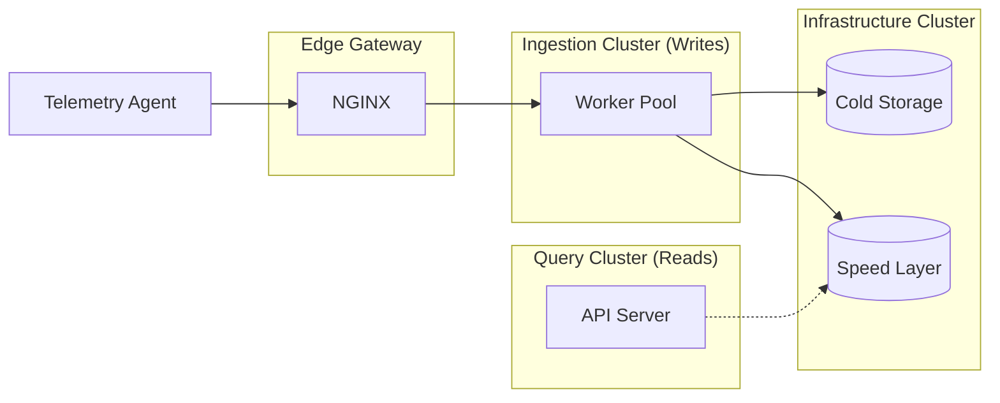

# Real-Time Telemetry Aggregator

A distributed system designed for high-frequency hardware telemetry ingestion. Built entirely in **Go**, this project demonstrates a highly concurrent, memory-efficient data pipeline capable of streaming metrics from edge devices to a centralized CQRS architecture.

## Architectural Highlights

- **Binary WebSockets:** Telemetry agents stream metrics using **Protobuf over persistent WebSockets**, bypassing the immense TCP and HTTP header overhead associated with traditional REST polling.
- **CQRS Implementation:**
- **Write Path (Cold Storage):** Ingestion is decoupled using a buffered Go channel. A dynamically sized **Worker Pool** pulls from the buffer and executes bulk `COPY` operations into **PostgreSQL** every 30 seconds, protecting the database from IOPS exhaustion.
- **Read Path (Speed Layer):** Real-time queries are served from a **Redis** cluster.
- **Atomic Cache Pruning:** The aggregator utilizes a server-side **Lua Script** in Redis to atomically add new telemetry and prune data older than 30 minutes. This guarantees the Speed Layer maintains a strict O(1) memory footprint without requiring a secondary cleanup worker.
- **Infrastructure as Code:** Fully containerized using multi-stage Alpine images with an orchestrated `docker-compose` lifecycle. Schema management is strictly version-controlled using **Flyway**.



## Tech Stack

- **Language:** Go 1.26
- **Transport:** WebSockets (`gorilla/websocket`)
- **Serialization:** Protocol Buffers (Protobuf)
- **Database (Cold Storage):** PostgreSQL (`pgx` bulk operations) + Flyway
- **Cache (Speed Layer):** Redis (Sorted Sets + Lua Scripting)
- **Deployment:** Docker (Multi-stage)

## Project Structure

```text
├── cmd/
│   ├── agent/
│   │   ├── main.go            # Telemetry producer running on edge nodes. Edge device daemon utilizing `gopsutil` to scrape host CPU/Memory/Disk.
│   │   └── Dockerfile
│   ├── aggregator/
│   │   ├── main.go            # Central telemetry consumer. Ingestion server managing the WebSocket upgrader and PostgreSQL worker pool.
│   │   └── Dockerfile
│   └── api-server/
│   │   ├── main.go            # Lightweight REST API exposing the Redis Speed Layer to frontend consumers.
│   │   └── Dockerfile
├── proto/
│   ├── telemetry.proto        # Protobuf schema definitions.
│   └── telemetry.pb.go        # Generated Go structs.
├── schema/                    # Immutable SQL migrations enforced by Flyway on startup.
│   └── V1__Create_telemetry_table.sql
├── secrets/                  # Docker secrets storage. (Sample files inside)
└── docker-compose.yml         # Local cluster orchestration.
```

## Getting Started

### 1. Configuring Secrets

Create a secure password file for the database initialization:

```bash
echo "your_secure_password" > secrets/database_password.txt
```

You will need to create a `flyway.toml` inside the `secrets` folder to configure the migration URL and credentials. See the example `secrets/flyway.toml.example` file or the [Flyway 10+ TOML configuration documentation](https://www.red-gate.com/hub/product-learning/flyway/getting-started-with-toml-flyway).

### 2. Local SSL Configuration

This architecture utilizes NGINX as a **Layer 7 API Gateway** to terminate SSL/TLS at the edge. To run the cluster locally, you must generate a self-signed certificate.

Run the following command from the root of the project to generate the required keys into the `/certs` directory:

**For Linux / macOS:**

```bash
mkdir -p certs
openssl req -x509 -nodes -days 365 -newkey rsa:2048 \
  -keyout certs/nginx.key -out certs/nginx.crt \
  -subj "/C=US/ST=CA/L=Sacramento/O=Dev/CN=localhost"
```

**For Windows (Git Bash):**

_Note: Git Bash requires the `MSYS_NO_PATHCONV=1` flag to prevent it from aggressively translating the `/C=US` subject string into a Windows `C:\ `drive path._

```bash
mkdir -p certs
MSYS_NO_PATHCONV=1 openssl req -x509 -nodes -days 365 -newkey rsa:2048 \
  -keyout certs/nginx.key -out certs/nginx.crt \
  -subj "/C=US/ST=CA/L=Sacramento/O=Dev/CN=localhost"
```

Once generated, NGINX will successfully mount the certificates and handle automatic HTTP-to-HTTPS (Port 80 -> 443) redirections. Note that since this is a self-signed certificate, you will need to bypass the security warning in your browser or pass the `-k` flag if testing via cURL.

### 3. Boot the Cluster

```bash
docker-compose up --build
```

\*_This orchestrates the startup sequence:_

1. The **Aggregator** boots on port `8080` and spins up 50 idle background workers.
2. The **Agent** boots, resolves the aggregator's internal DNS, and establishes a persistent WebSocket connection.
3. The **API server** boots on port `8081` and listens for machine status requests.
4. Every 5 seconds, the Agent scrapes the host container's CPU, Memory, and Disk usage, serializes it to Protobuf, and pushes it through the socket.
5. The Aggregator parses the binary payload and hands it off to the worker pool for processing.

### 4. Query Real-Time Status

To fetch a list of active machines from the Redis Speed Layer:

```bash
curl -k https://localhost:443/machines

{"active_machines":["cd7f4c2529ba","24969196194c","1931c5171419","f29d18770fad","0d21a1cb6889"],"count":5}
```

To fetch the sub-millisecond latest state of a machine from the Redis Speed Layer:

```bash
# Check the Agent logs for its unique machine_id
curl -k https://localhost:443/status/24969196194c

{"machine_id":"24969196194c", "measured_at":"2026-04-30T22:25:08.178389472Z", "cpu_usage":0.33361134278535104, "memory_usage":13.150587185967, "disk_usage":2.737032166903607}
```

### Simulating Graceful Shutdown

To observe the graceful shutdown sequence, press the stop button for the compose stack in Docker Desktop. You will see the Aggregator stop accepting new connections, wait for the workers to drain the data channel, and exit cleanly with code `0`.

---

_Developed as a demonstration of high-throughput Go architecture and distributed system design._
